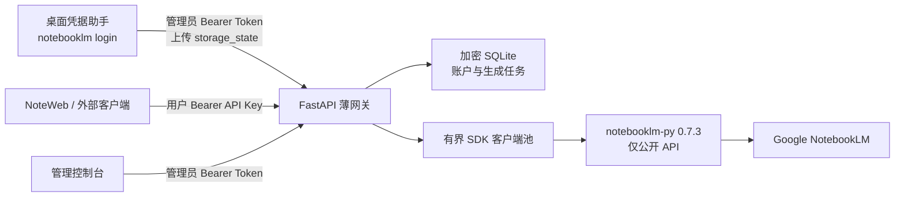

# NotebookLM Gateway

基于 `notebooklm-py==0.7.3` 稳定版公开 Python API 的多租户薄网关，内置响应式 NoteWeb、账户管理页和桌面凭据助手。

> 本项目使用 NotebookLM 的非官方 SDK，不是 Google 官方产品。上游接口可能变化；生产升级前请先在测试环境验证。

## 当前架构

本项目采用“稳定版公开 Python API + 自有薄网关”：仓库不再内嵌或修改 `notebooklm-py` 源码，也不依赖它的私有模块或实验性 Server 实现。



这样做的理由和边界见 [架构决策](docs/architecture.md)，旧版本升级步骤见 [迁移指南](docs/migration.md)。

## 主要能力

- 笔记本、来源、对话、深度研究、笔记和共享管理。
- Studio 支持音频、视频、电影视频、报告、测验、闪卡、信息图、幻灯片、数据表、思维导图共 10 类生成物。
- Studio 映射稳定版 SDK 的语言、来源、格式、长度、风格、难度、方向、详细度和自定义指令参数。
- 生成任务按账户持久化，服务重启后仍可继续查询；下载时使用明确的 `artifact_id`。
- SQLite 中的 API Key、Cookie Storage State 和兼容字段使用 Fernet 加密；用户 Key 以 HMAC 索引查找。
- SDK 客户端池有容量上限、空闲回收、每账户并发初始化锁和 Cookie 变更回写。
- NoteWeb 支持桌面与移动端、会话级 Key 保存、安全 DOM 渲染和音视频、图片、PDF、文本、JSON 预览。
- NoteWeb 使用 `liquid-glass-react` 1.1.1 渐进增强关键界面；不支持 SVG 位移的浏览器自动保留 CSS 玻璃回退。

## 快速部署

要求 Docker Compose，或 Python 3.11–3.14。

### Docker Compose

```bash
cp .env.example .env
python -c 'import secrets; print(secrets.token_urlsafe(48))'
# 将输出写入 .env 的 GATEWAY_ADMIN_TOKEN
docker compose up -d --build
```

启动后访问：

- NoteWeb：`http://localhost:18388/noteweb/`
- 管理控制台：`http://localhost:18388/admin`
- OpenAPI：`http://localhost:18388/docs`
- 健康检查：`http://localhost:18388/healthz`

`GATEWAY_ADMIN_TOKEN` 必须至少 32 字节；示例占位值和旧版默认值会被拒绝。`data/` 必须持久化，其中 `gateway.db` 和 `.gateway-key` 缺一不可。

### 本地运行

```bash
python -m venv .venv
source .venv/bin/activate
pip install -e .
export GATEWAY_ADMIN_TOKEN="$(python -c 'import secrets; print(secrets.token_urlsafe(48))')"
uvicorn gateway_server.main:app --host 0.0.0.0 --port 18388
```

生产环境可使用经过验证的精确依赖：

```bash
pip install -r requirements.lock
pip install --no-deps .
```

## 添加 NotebookLM 账户

推荐使用桌面凭据助手。它调用 `notebooklm-py` 文档化的 `notebooklm login` 流程，并只向网关上传生成的 `storage_state.json`。

```bash
python -m venv .venv-client
source .venv-client/bin/activate
pip install -e '.[client]'
python gateway_client/app.py
```

在助手中填写：

1. 网关地址，例如 `https://gateway.example.com`。
2. `GATEWAY_ADMIN_TOKEN`。
3. 账户邮箱，以及为该账户生成的独立用户 API Key（至少 16 字符）。
4. 点击浏览器登录，在系统 Chrome 中完成 Google/NotebookLM 登录后返回助手上传。

也可手动调用管理接口：

```bash
curl -X POST http://localhost:18388/v1/auth/credentials \
  -H "Authorization: Bearer $GATEWAY_ADMIN_TOKEN" \
  -H 'Content-Type: application/json' \
  -d @- <<'JSON'
{
  "email": "user@example.com",
  "api_key": "replace-with-a-unique-user-key",
  "storage_state": "{\"cookies\":[],\"origins\":[]}"
}
JSON
```

`storage_state` 是 JSON 字符串，并且必须包含 `cookies` 数组。真实凭据应由登录工具产生，不要使用上面的空 Cookie 示例访问 NotebookLM。

## 认证模型

系统严格分离两类 Bearer Token：

- 管理 Token：仅用于 `/v1/auth/credentials` 和 `/admin/api/*`。不能调用笔记本业务 API。
- 用户 API Key：绑定一个 NotebookLM 账户，仅用于 `/v1/server/info` 和 `/v1/notebooks/*`。不能调用管理接口。

```bash
curl http://localhost:18388/v1/notebooks \
  -H "Authorization: Bearer $USER_API_KEY"
```

管理页将 Token 保存在 `sessionStorage`；NoteWeb 默认也只在当前会话保存用户 Key，只有用户主动勾选后才写入 `localStorage`。

## Studio 示例

```bash
curl -X POST http://localhost:18388/v1/notebooks/NOTEBOOK_ID/artifacts \
  -H "Authorization: Bearer $USER_API_KEY" \
  -H 'Content-Type: application/json' \
  -d '{
    "type": "infographic",
    "source_ids": ["SOURCE_ID"],
    "language": "zh_Hans",
    "instructions": "面向管理层，突出三项关键结论",
    "orientation": "landscape",
    "detail_level": "detailed",
    "infographic_style": "professional"
  }'
```

创建接口返回 `task_id` 后，使用同一账户和笔记本轮询：

```bash
curl http://localhost:18388/v1/notebooks/NOTEBOOK_ID/artifacts/TASK_ID \
  -H "Authorization: Bearer $USER_API_KEY"
```

完整参数、下载格式和路由见 [API 文档](API.md)。

## 配置

| 环境变量 | 默认值 | 说明 |
| --- | ---: | --- |
| `GATEWAY_ADMIN_TOKEN` | 无 | 必填，至少 32 字节 |
| `GATEWAY_DATA_DIR` | `data` | 数据库、密钥和 SDK Profile 目录 |
| `GATEWAY_ENCRYPTION_KEY` | 自动生成 | 可选 Fernet Key；设置后必须稳定持久化 |
| `GATEWAY_CORS_ORIGINS` | 空 | 逗号分隔的允许 Origin；同域部署留空 |
| `GATEWAY_MAX_CLIENTS` | `20` | SDK 客户端池上限 |
| `GATEWAY_CLIENT_IDLE_SECONDS` | `1800` | 空闲回收秒数 |
| `GATEWAY_KEEPALIVE_SECONDS` | `600` | SDK 会话保活周期 |
| `GATEWAY_MAX_UPLOAD_BYTES` | `104857600` | 单文件上传上限 |
| `GATEWAY_PORT` | `18388` | Compose 对外映射端口 |

## 安全与运维

- 请通过 HTTPS 反向代理公开服务；不要把管理页和管理 Token 暴露给不可信网络。
- 不要提交 `.env`、`data/`、`gateway_client/settings.json` 或任何 `storage_state.json`。
- 整体备份 `data/`。丢失 `.gateway-key`（或配置的 `GATEWAY_ENCRYPTION_KEY`）后，数据库中的凭据无法恢复。
- CORS 默认关闭；仅在前后端分离部署时设置精确 HTTPS Origin，避免使用通配符。
- NotebookLM 身份失效时账户会标记为 `expired`；重新使用桌面助手登录并上传即可恢复为 `active`。
- 本项目不记录 Google 密码；浏览器登录发生在 Google/NotebookLM 页面。

## 已知边界

- `notebooklm-py 0.7.3` 的公开 API 没有研究任务取消能力，因此取消路由明确返回 `501`，NoteWeb 中相应按钮禁用。
- 稳定版公开 API 没有 master-token 自动引导接口；凭据续期依赖文档化的浏览器登录和 Cookie 回写。
- 生成物“查看参数/重试”只适用于经本网关创建并有持久化任务记录的生成物。
- 上游是非官方接口；速率限制、生成能力和返回结构仍可能由 NotebookLM 调整。

## 开发与验证

```bash
pip install -e '.[test]'
pytest -q
python -m compileall -q gateway_server gateway_client tests
for file in noteweb/js/*.js noteweb/js/components/*.js; do node --check "$file"; done

# 重建 LiquidGlass 视觉增强 bundle
cd noteweb
npm ci
npm run check
cd ..

# 对运行中的实例执行只读冒烟测试
GATEWAY_USER_API_KEY=... python test_api_connection.py

cd docs
npm ci
npm run docs:build
```

## 文档

- [REST API](API.md)
- [架构决策](docs/architecture.md)
- [旧版迁移指南](docs/migration.md)
- [在线文档站源码](docs/index.md)
- 运行中的交互式 OpenAPI：`/docs`

## License

MIT。NoteWeb 第三方组件许可见 [THIRD_PARTY_NOTICES.md](noteweb/THIRD_PARTY_NOTICES.md)。
