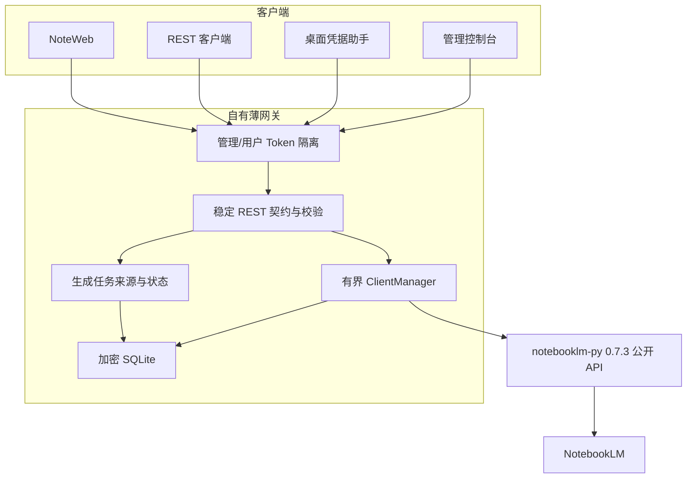

# 架构决策：稳定版公开 API + 自有薄网关

## 结论

Gateway Server 直接依赖精确锁定的 `notebooklm-py==0.7.3`，仅调用它的公开 Python API；仓库不再保留 `gateway_server/notebooklm/` 副本，也不复制参考项目的私有 Server 实现。

这是当前的方案 A。它把 NotebookLM 协议适配交给上游 SDK，把多租户、认证、数据安全、任务持久化和前端契约留在本项目。

## 为什么不保留内嵌源码

旧目录包含完整 SDK、CLI、MCP、Server 和内部传输层，远超网关实际需要。继续维护会产生三个版本源：PyPI、仓库副本和网关补丁，很难确认错误属于哪一层，也容易让业务代码依赖 `_auth`、`_artifact`、`server` 等私有模块。

移除后，依赖边界由 `pyproject.toml` 和 `requirements.lock` 明确表达；升级可以通过公开签名差异和自动测试评估，而不是手工合并数万行源代码。

## 对参考项目的判断

`gnh1201/notebooklm-rest-api` 证明了“REST 服务直接引用 `notebooklm-py` 包”的方向可行，但不能原样采用：它锁定的是更早 SDK，认证挂载、接口覆盖和多租户数据治理不满足本项目要求。

本项目借鉴的是依赖方式，不复制其版本、认证或路由实现。

## 组件职责



### 网关拥有

- 管理 Token 与用户 API Key 的权限隔离。
- 账户状态、密钥唯一性、上传限制和 CORS 策略。
- 凭据加密、HMAC 查找索引和旧明文数据迁移。
- SDK 客户端的创建、并发初始化、复用、回收和 Cookie 回写。
- 对外 Schema、错误映射和明确的 HTTP 状态码。
- Studio 任务归属、创建参数、重启恢复、精确下载 ID。
- NoteWeb、管理页和桌面登录工作流。

NoteWeb 的业务逻辑继续使用原生 ES Modules；`liquid-glass-react` 通过独立 React 入口只增强标记了 `data-liquid-glass` 的表面。构建产物随静态文件提交并打包，运行时不依赖 Node.js。组件无法完整工作的浏览器仍使用 CSS `backdrop-filter`/半透明边框回退，且 `prefers-reduced-motion` 会关闭弹性运动。

### 上游 SDK 拥有

- NotebookLM RPC 和响应解析。
- Cookie Storage State 登录会话。
- 笔记本、来源、对话、研究、笔记、Studio 和共享的实际操作。
- 上游重试、速率限制和认证异常类型。

## 数据安全

数据目录默认是 `data/`：

```text
data/
├── .gateway-key            # 自动生成的 Fernet Key，0600
├── gateway.db              # 账户与生成任务
└── profiles/
    └── <account_id>/
        └── storage_state.json  # SDK 运行副本，0600
```

SQLite 中的 `api_key`、`storage_state`、旧 `master_token` 和 `android_id` 以 Fernet 加密。用户 Key 查找使用密钥派生 HMAC，不靠明文扫描。旧数据库首次启动时原地增加列和索引，并加密已有明文。

`.gateway-key` 与 `gateway.db` 是一个不可拆分的备份单元。使用 `GATEWAY_ENCRYPTION_KEY` 时，也必须由密钥管理系统稳定保存同一 Fernet Key。

## 客户端生命周期

每个活动账户最多对应一个 SDK 客户端。`ClientManager`：

1. 从加密数据库读取 Storage State。
2. 原子写入账户专属 Profile，权限设为 `0700/0600`。
3. 通过 `NotebookLMClient.from_storage` 创建公开 SDK 客户端。
4. 使用每账户锁避免并发重复登录，使用引用计数避免回收使用中的客户端。
5. 按空闲时间和池容量执行 LRU 回收。
6. 请求后仅在文件摘要变化时把刷新后的 Cookie 回写数据库。
7. 只有明确的 `AuthError` 才把账户标记为 `expired`，网络错误不会误伤账户。

## Studio 任务模型

创建生成物前，REST Schema 先校验类型和参数；调用成功拿到 `task_id` 后，网关保存：账户、笔记本、类型、请求参数、状态和错误。

轮询必须命中同一账户与笔记本的任务记录，防止跨租户枚举。列表把上游已经可见的生成物与本地未完成任务合并。下载明确传入 `artifact_id`，避免旧实现“取最新一个”的竞态。

思维导图的公开 SDK 调用同步返回结果，因此网关将它记录为已完成任务。电影视频完成后由上游以视频生成物表示。

## 公开 API 边界

允许：

- `from notebooklm import NotebookLMClient, ...`
- SDK 文档和顶层导出的类型、枚举、异常。

禁止：

- `notebooklm._*`
- `notebooklm.server.*`
- 复制上游包文件后直接修改。
- 依赖仅存在于 `main` 分支、尚未进入稳定发行版的签名。

因此，稳定版没有公开能力时，网关会明确降级而不绕过边界。例如研究取消返回 `501`，master-token 自动引导不再提供。

## SDK 升级流程

1. 阅读目标稳定版本的 Python API 文档和 changelog。
2. 在隔离虚拟环境安装目标版本，核对顶层导出和生成器签名。
3. 修改 `pyproject.toml` 的精确版本，并重新生成 `requirements.lock`。
4. 调整 Schema、序列化和 NoteWeb 参数；不得用私有模块补齐差异。
5. 运行单元测试、JavaScript 检查、文档构建、容器构建和浏览器桌面/窄屏验证。
6. 更新 README、API、本文和迁移说明后发布。

若稳定版公开 API 无法满足不可妥协的需求，应先写新的架构决策，再考虑受控适配层；不能悄悄恢复整个上游源码副本。
